# Diagramas de secuencia — Administración

Estos diagramas describen el comportamiento implementado en el panel de
Administración. Están escritos en Mermaid y pueden visualizarse en GitHub,
GitLab, Notion o cualquier editor compatible.

Los participantes se agrupan así: **Administrador** es una cuenta con acceso al
panel; **Dirección** es la única cuenta que puede revisar evidencias, operar
sorteos o cambiar reglas de marcado; **Supabase** representa Auth, RPC y las
tablas protegidas por RLS.

## 1. Entrada al dominio Administración y carga del resumen

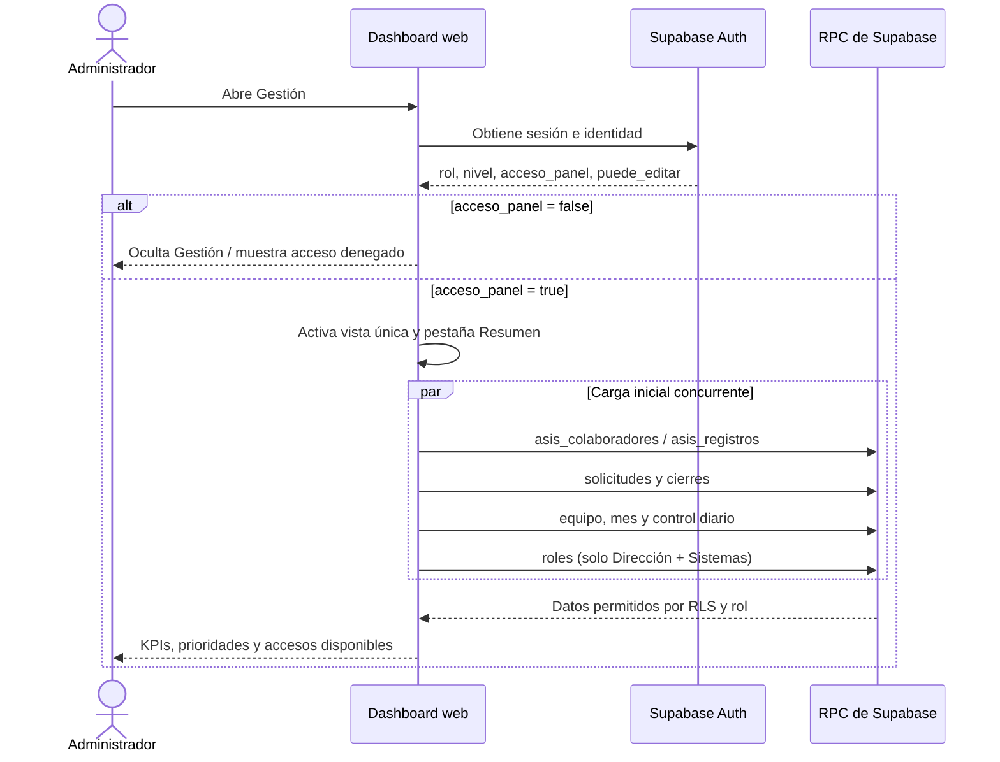

## 2. Pasar lista: marcar, corregir o retirar una asistencia

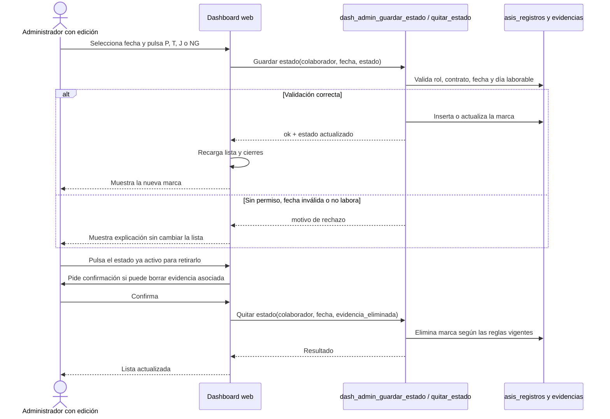

## 3. Gestión mensual: excepción, feriado o corrección

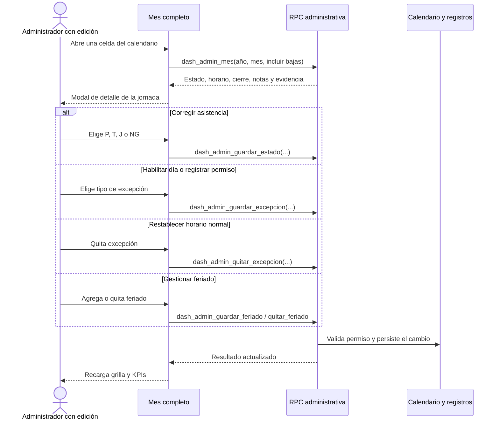

## 4. Cierre normal de jornada por el colaborador

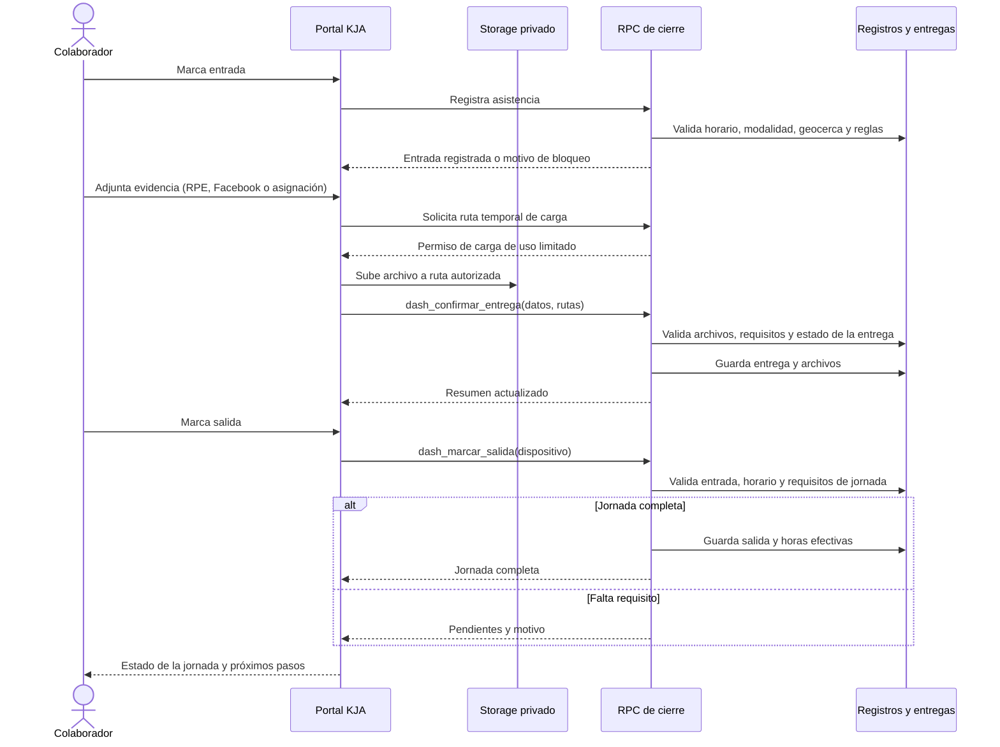

## 5. Revisión de evidencias desde Cierres y entregables

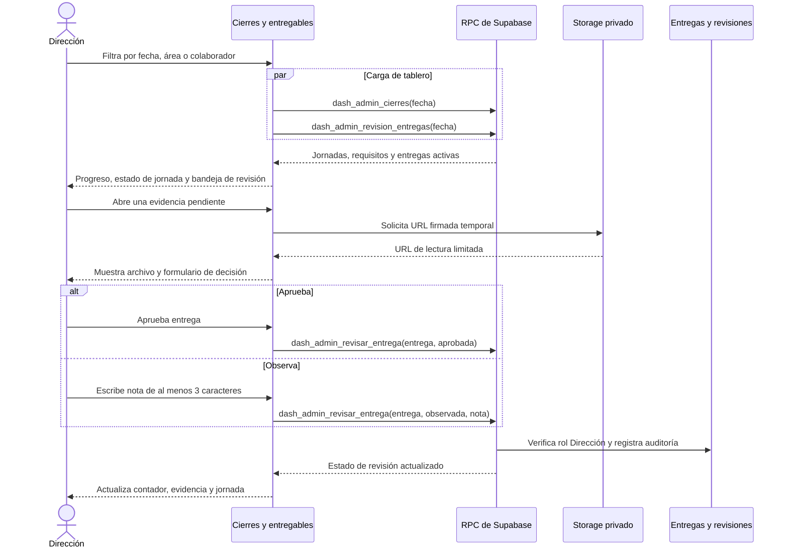

## 6. Dirección carga una evidencia recibida por otro canal

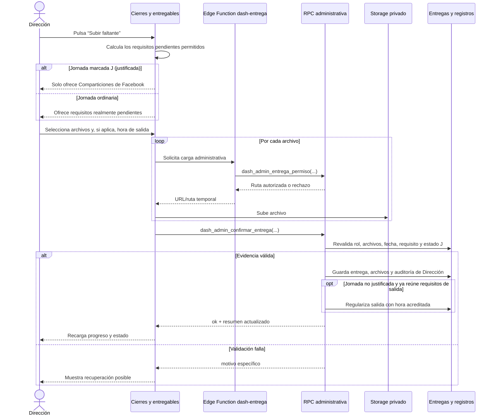

## 7. Crear una asignación o realizar un sorteo

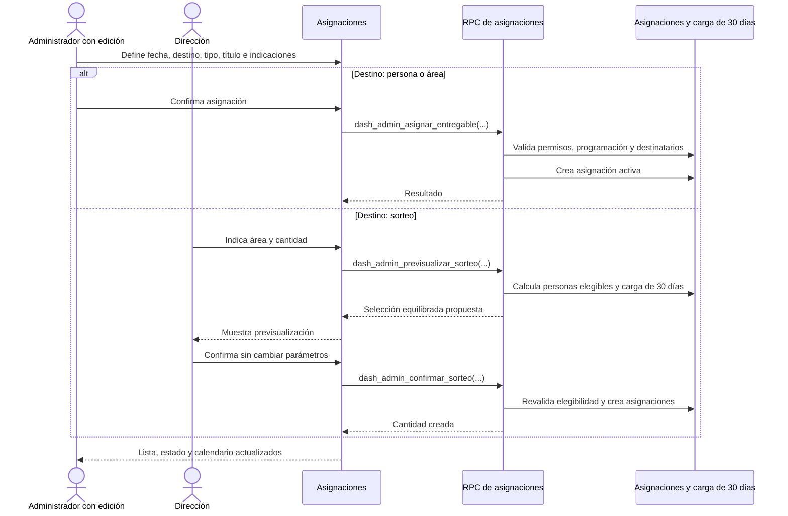

## 8. Retiro de una asignación y limpieza de archivos

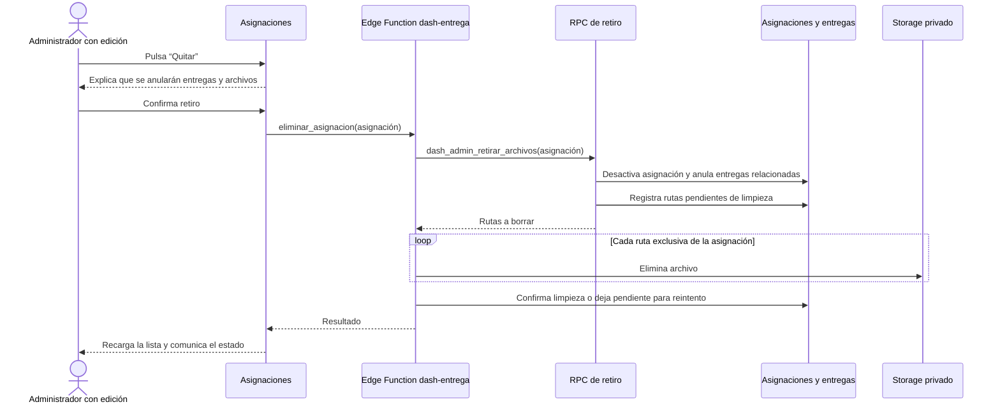

## 9. Alta o actualización de colaborador

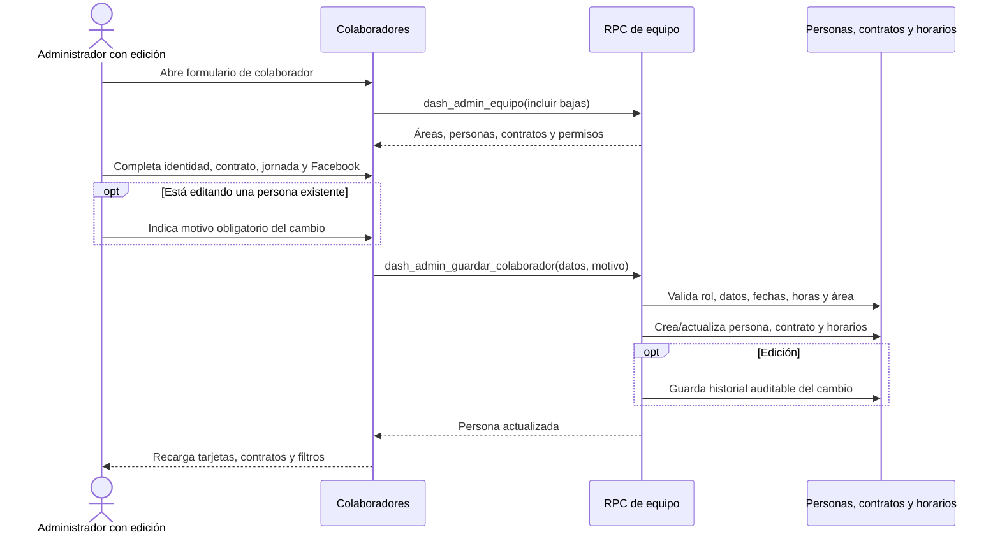

## 10. Marcado propio: reglas, PIN y solicitud de horario

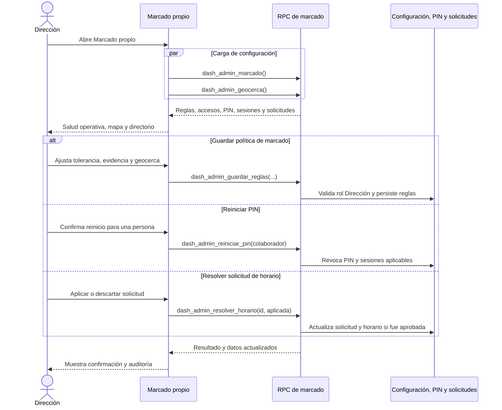

## 11. Asignar, reemplazar o retirar liderazgo

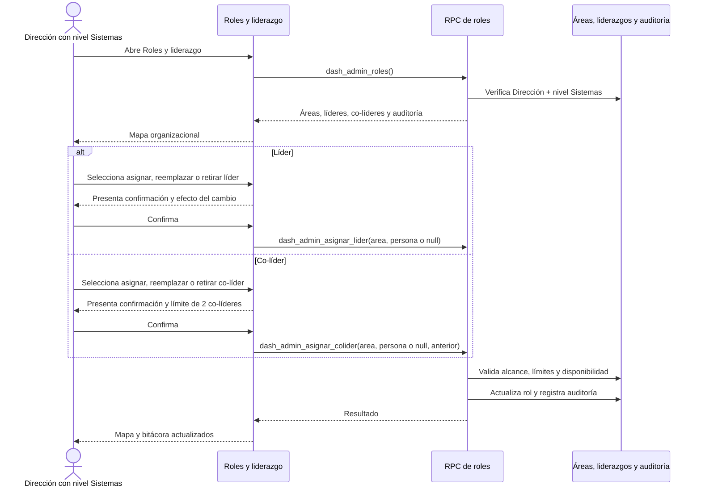

## Reglas transversales que aplican a todos los diagramas

- El frontend decide qué controles mostrar; el servidor vuelve a validar cada
  operación. Alterar HTML o conocer una URL no concede permiso.
- Las operaciones de lectura y mutación pasan por RPC protegidas por sesión,
  rol, nivel y RLS.
- Las evidencias privadas no exponen una ruta pública: se cargan con permisos
  temporales y se consultan con URL firmadas de duración limitada.
- Las acciones que retiran datos, reinician PIN o cambian responsables piden
  confirmación antes de enviar la mutación.
- La jornada `J` conserva su registro y sus evidencias; en Cierres solo queda
  exigible la compartición de Facebook cuando corresponde al horario.
