# Diagramas de secuencia — Portal KJA (PlantUML)

**Versión:** 1.0 · **Fecha:** 22/09/2026 · **Estado:** revisión documental del código local.

Los once primeros diagramas mantienen el orden de los procesos administrativos
anteriores; DS-012 en adelante amplían el alcance al portal completo. Los nombres
de RPC son referencias a código local; `...` omite parámetros, no es una firma
ejecutable. Mensajes conceptuales agrupan detalles internos. Cada operación debe
validar sesión y permisos en servidor; un rechazo termina esa operación sin
ejecutar sus pasos dependientes, aunque no se repita la rama en cada llamada.
Storage es un servicio independiente: un borrado no forma parte de una transacción SQL.

Enlaces: [requerimientos](01-requerimientos-portal-asistencia.md) ·
[matriz](27-matriz-requerimientos.md).

## DS-001. Acceso a Administración y resumen

**Trazabilidad:** RF-049–RF-057, RF-064–RF-070, RF-114–RF-118. La matriz detalla asociaciones y RNF.

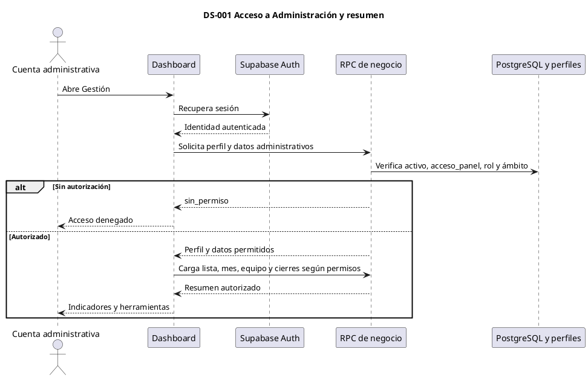
```plantuml
@startuml
title DS-001 Acceso a Administración y resumen
actor "Cuenta administrativa" as U
participant "Dashboard" as W
participant "Supabase Auth" as A
participant "RPC de negocio" as R
participant "PostgreSQL y perfiles" as B
U -> W: Abre Gestión
W -> A: Recupera sesión
A --> W: Identidad autenticada
W -> R: Solicita perfil y datos administrativos
R -> B: Verifica activo, acceso_panel, rol y ámbito
alt Sin autorización
R --> W: sin_permiso
W --> U: Acceso denegado
else Autorizado
R --> W: Perfil y datos permitidos
W -> R: Carga lista, mes, equipo y cierres según permisos
R --> W: Resumen autorizado
W --> U: Indicadores y herramientas
end
@enduml
```

## DS-002. Pasar lista y retirar asistencia

**Trazabilidad:** RF-071–RF-078, RF-096. La matriz detalla asociaciones y RNF.

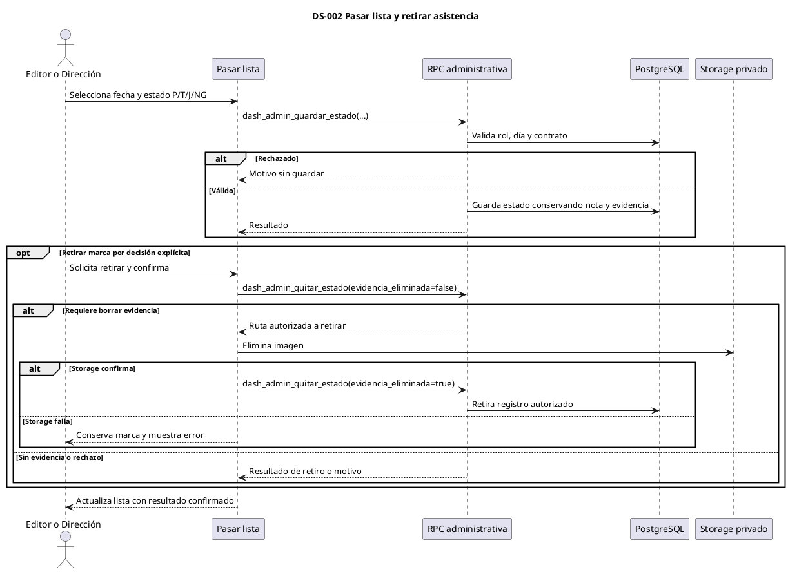
```plantuml
@startuml
title DS-002 Pasar lista y retirar asistencia
actor "Editor o Dirección" as U
participant "Pasar lista" as W
participant "RPC administrativa" as R
participant "PostgreSQL" as B
participant "Storage privado" as S
U -> W: Selecciona fecha y estado P/T/J/NG
W -> R: dash_admin_guardar_estado(...)
R -> B: Valida rol, día y contrato
alt Rechazado
R --> W: Motivo sin guardar
else Válido
R -> B: Guarda estado conservando nota y evidencia
R --> W: Resultado
end
opt Retirar marca por decisión explícita
U -> W: Solicita retirar y confirma
W -> R: dash_admin_quitar_estado(evidencia_eliminada=false)
alt Requiere borrar evidencia
R --> W: Ruta autorizada a retirar
W -> S: Elimina imagen
alt Storage confirma
W -> R: dash_admin_quitar_estado(evidencia_eliminada=true)
R -> B: Retira registro autorizado
else Storage falla
W --> U: Conserva marca y muestra error
end
else Sin evidencia o rechazo
R --> W: Resultado de retiro o motivo
end
end
W --> U: Actualiza lista con resultado confirmado
@enduml
```

## DS-003. Mes completo, excepciones y exportación

**Trazabilidad:** RF-091–RF-101. La matriz detalla asociaciones y RNF.

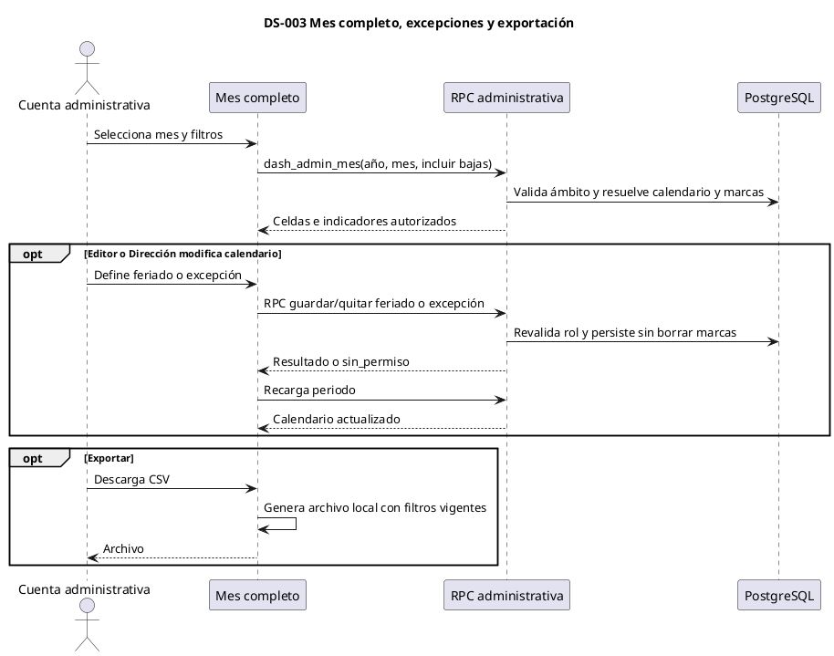
```plantuml
@startuml
title DS-003 Mes completo, excepciones y exportación
actor "Cuenta administrativa" as U
participant "Mes completo" as W
participant "RPC administrativa" as R
participant "PostgreSQL" as B
U -> W: Selecciona mes y filtros
W -> R: dash_admin_mes(año, mes, incluir bajas)
R -> B: Valida ámbito y resuelve calendario y marcas
R --> W: Celdas e indicadores autorizados
opt Editor o Dirección modifica calendario
U -> W: Define feriado o excepción
W -> R: RPC guardar/quitar feriado o excepción
R -> B: Revalida rol y persiste sin borrar marcas
R --> W: Resultado o sin_permiso
W -> R: Recarga periodo
R --> W: Calendario actualizado
end
opt Exportar
U -> W: Descarga CSV
W -> W: Genera archivo local con filtros vigentes
W --> U: Archivo
end
@enduml
```

## DS-004. Cierre laboral y registro de salida

**Trazabilidad:** RF-132–RF-136, RF-140–RF-144. La matriz detalla asociaciones y RNF.

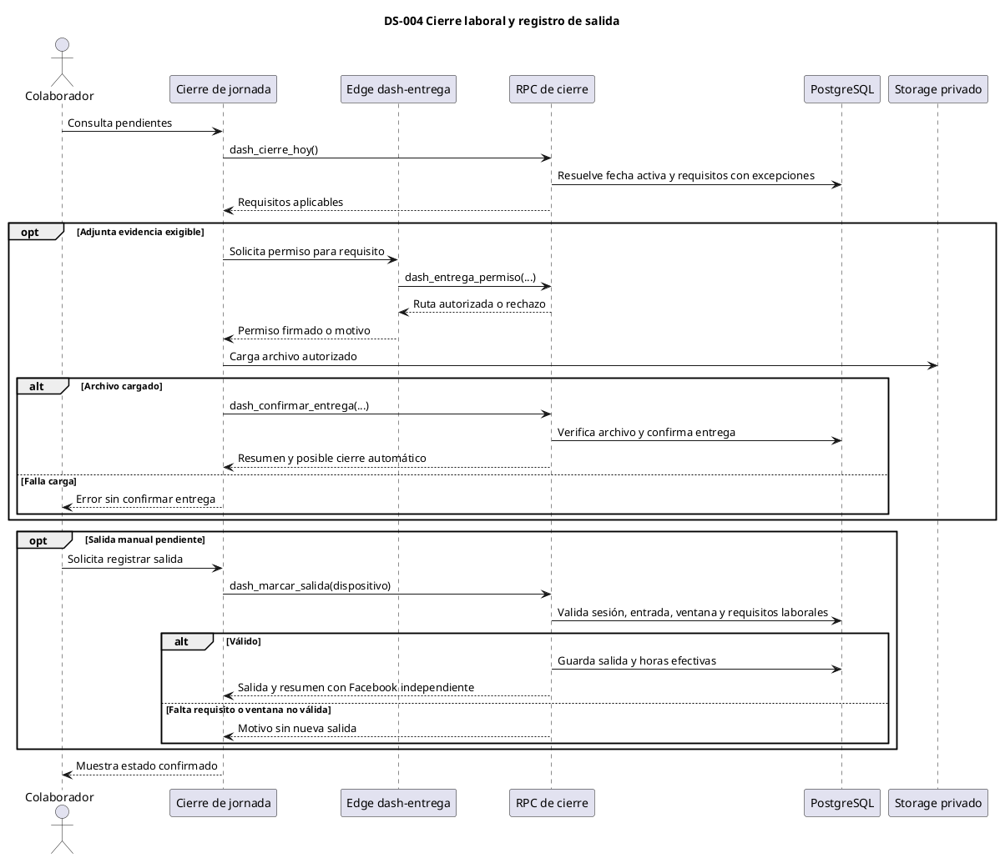
```plantuml
@startuml
title DS-004 Cierre laboral y registro de salida
actor "Colaborador" as U
participant "Cierre de jornada" as W
participant "Edge dash-entrega" as E
participant "RPC de cierre" as R
participant "PostgreSQL" as B
participant "Storage privado" as S
U -> W: Consulta pendientes
W -> R: dash_cierre_hoy()
R -> B: Resuelve fecha activa y requisitos con excepciones
R --> W: Requisitos aplicables
opt Adjunta evidencia exigible
W -> E: Solicita permiso para requisito
E -> R: dash_entrega_permiso(...)
R --> E: Ruta autorizada o rechazo
E --> W: Permiso firmado o motivo
W -> S: Carga archivo autorizado
alt Archivo cargado
W -> R: dash_confirmar_entrega(...)
R -> B: Verifica archivo y confirma entrega
R --> W: Resumen y posible cierre automático
else Falla carga
W --> U: Error sin confirmar entrega
end
end
opt Salida manual pendiente
U -> W: Solicita registrar salida
W -> R: dash_marcar_salida(dispositivo)
R -> B: Valida sesión, entrada, ventana y requisitos laborales
alt Válido
R -> B: Guarda salida y horas efectivas
R --> W: Salida y resumen con Facebook independiente
else Falta requisito o ventana no válida
R --> W: Motivo sin nueva salida
end
end
W --> U: Muestra estado confirmado
@enduml
```

## DS-005. Revisión de entregas

**Trazabilidad:** RF-137, RF-141, RF-152, RF-155–RF-156. La matriz detalla asociaciones y RNF.

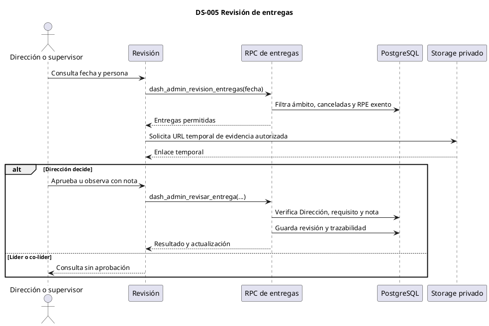
```plantuml
@startuml
title DS-005 Revisión de entregas
actor "Dirección o supervisor" as U
participant "Revisión" as W
participant "RPC de entregas" as R
participant "PostgreSQL" as B
participant "Storage privado" as S
U -> W: Consulta fecha y persona
W -> R: dash_admin_revision_entregas(fecha)
R -> B: Filtra ámbito, canceladas y RPE exento
R --> W: Entregas permitidas
W -> S: Solicita URL temporal de evidencia autorizada
S --> W: Enlace temporal
alt Dirección decide
U -> W: Aprueba u observa con nota
W -> R: dash_admin_revisar_entrega(...)
R -> B: Verifica Dirección, requisito y nota
R -> B: Guarda revisión y trazabilidad
R --> W: Resultado y actualización
else Líder o co-líder
W --> U: Consulta sin aprobación
end
@enduml
```

## DS-006. Carga administrativa y regularización

**Trazabilidad:** RF-135–RF-143, RF-153. La matriz detalla asociaciones y RNF.

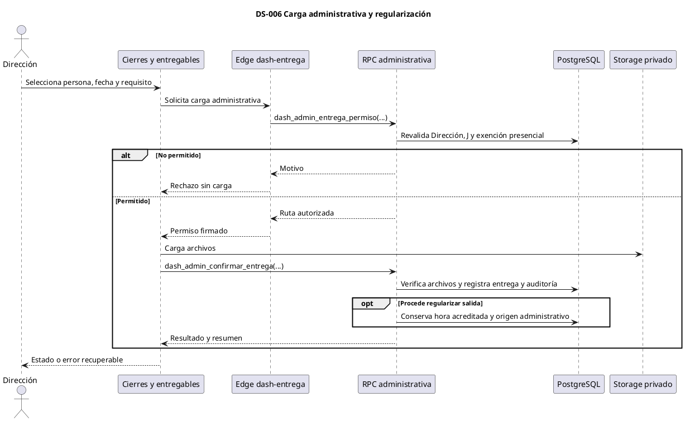
```plantuml
@startuml
title DS-006 Carga administrativa y regularización
actor "Dirección" as U
participant "Cierres y entregables" as W
participant "Edge dash-entrega" as E
participant "RPC administrativa" as R
participant "PostgreSQL" as B
participant "Storage privado" as S
U -> W: Selecciona persona, fecha y requisito
W -> E: Solicita carga administrativa
E -> R: dash_admin_entrega_permiso(...)
R -> B: Revalida Dirección, J y exención presencial
alt No permitido
R --> E: Motivo
E --> W: Rechazo sin carga
else Permitido
R --> E: Ruta autorizada
E --> W: Permiso firmado
W -> S: Carga archivos
W -> R: dash_admin_confirmar_entrega(...)
R -> B: Verifica archivos y registra entrega y auditoría
opt Procede regularizar salida
R -> B: Conserva hora acreditada y origen administrativo
end
R --> W: Resultado y resumen
end
W --> U: Estado o error recuperable
@enduml
```

## DS-007. Asignación directa y sorteo

**Trazabilidad:** RF-148–RF-150. La matriz detalla asociaciones y RNF.

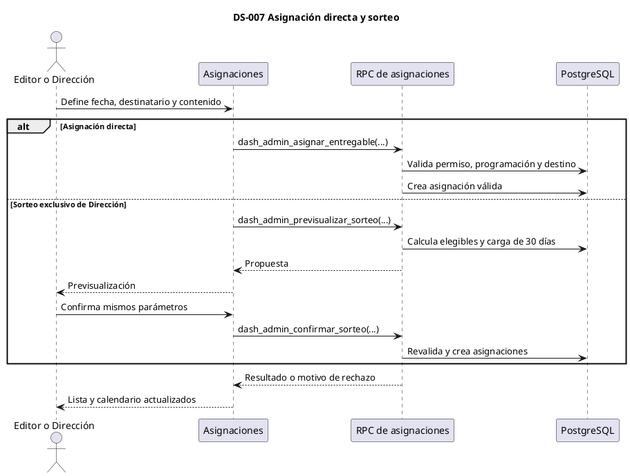
```plantuml
@startuml
title DS-007 Asignación directa y sorteo
actor "Editor o Dirección" as U
participant "Asignaciones" as W
participant "RPC de asignaciones" as R
participant "PostgreSQL" as B
U -> W: Define fecha, destinatario y contenido
alt Asignación directa
W -> R: dash_admin_asignar_entregable(...)
R -> B: Valida permiso, programación y destino
R -> B: Crea asignación válida
else Sorteo exclusivo de Dirección
W -> R: dash_admin_previsualizar_sorteo(...)
R -> B: Calcula elegibles y carga de 30 días
R --> W: Propuesta
W --> U: Previsualización
U -> W: Confirma mismos parámetros
W -> R: dash_admin_confirmar_sorteo(...)
R -> B: Revalida y crea asignaciones
end
R --> W: Resultado o motivo de rechazo
W --> U: Lista y calendario actualizados
@enduml
```

## DS-008. Retiro de asignación y limpieza

**Trazabilidad:** RF-150–RF-151. La matriz detalla asociaciones y RNF.

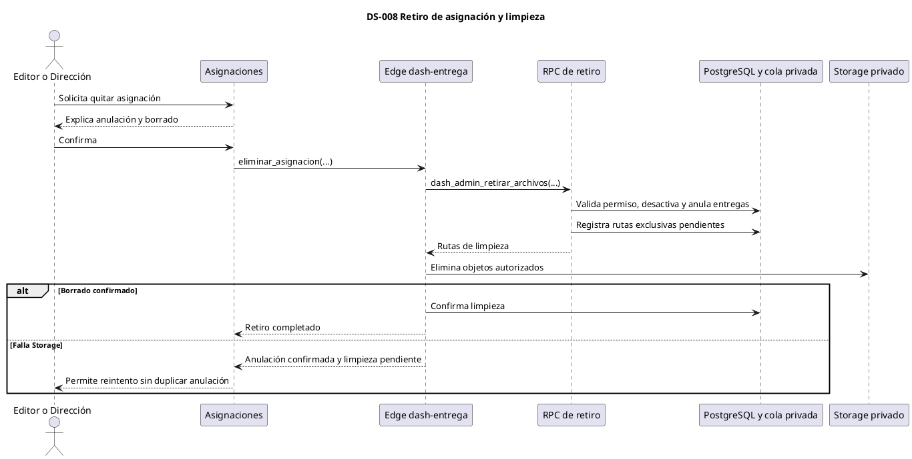
```plantuml
@startuml
title DS-008 Retiro de asignación y limpieza
actor "Editor o Dirección" as U
participant "Asignaciones" as W
participant "Edge dash-entrega" as E
participant "RPC de retiro" as R
participant "PostgreSQL y cola privada" as B
participant "Storage privado" as S
U -> W: Solicita quitar asignación
W --> U: Explica anulación y borrado
U -> W: Confirma
W -> E: eliminar_asignacion(...)
E -> R: dash_admin_retirar_archivos(...)
R -> B: Valida permiso, desactiva y anula entregas
R -> B: Registra rutas exclusivas pendientes
R --> E: Rutas de limpieza
E -> S: Elimina objetos autorizados
alt Borrado confirmado
E -> B: Confirma limpieza
E --> W: Retiro completado
else Falla Storage
E --> W: Anulación confirmada y limpieza pendiente
W --> U: Permite reintento sin duplicar anulación
end
@enduml
```

## DS-009. Colaboradores, contratos y áreas

**Trazabilidad:** RF-079–RF-090, RF-164. La matriz detalla asociaciones y RNF.

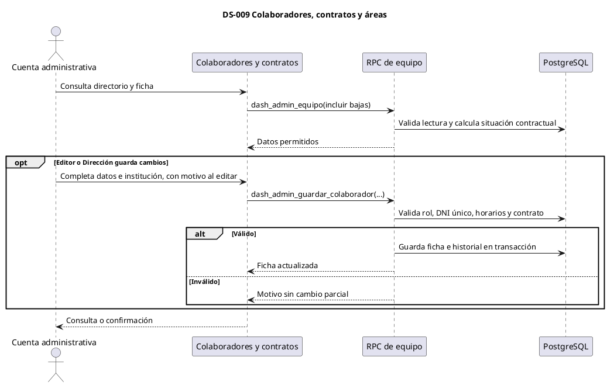
```plantuml
@startuml
title DS-009 Colaboradores, contratos y áreas
actor "Cuenta administrativa" as U
participant "Colaboradores y contratos" as W
participant "RPC de equipo" as R
participant "PostgreSQL" as B
U -> W: Consulta directorio y ficha
W -> R: dash_admin_equipo(incluir bajas)
R -> B: Valida lectura y calcula situación contractual
R --> W: Datos permitidos
opt Editor o Dirección guarda cambios
U -> W: Completa datos e institución, con motivo al editar
W -> R: dash_admin_guardar_colaborador(...)
R -> B: Valida rol, DNI único, horarios y contrato
alt Válido
R -> B: Guarda ficha e historial en transacción
R --> W: Ficha actualizada
else Inválido
R --> W: Motivo sin cambio parcial
end
end
W --> U: Consulta o confirmación
@enduml
```

## DS-010. Configuración de acceso, PIN y oficina

**Trazabilidad:** RF-102–RF-113, RF-130. La matriz detalla asociaciones y RNF.

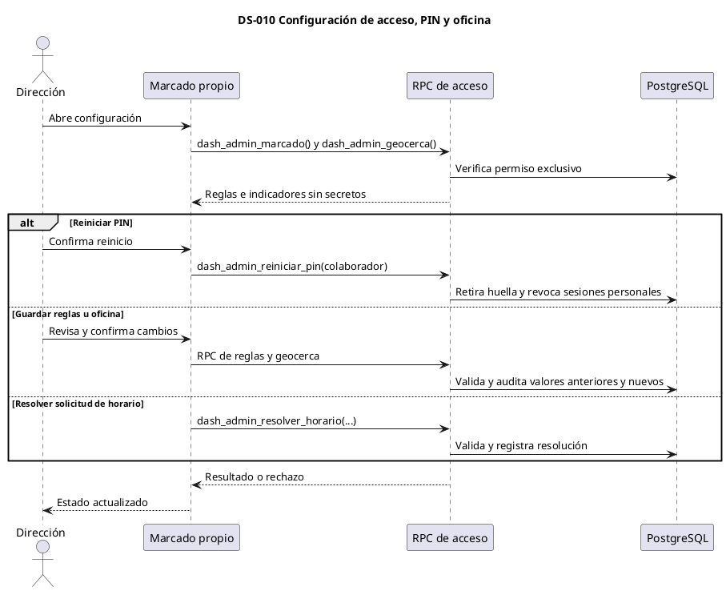
```plantuml
@startuml
title DS-010 Configuración de acceso, PIN y oficina
actor "Dirección" as U
participant "Marcado propio" as W
participant "RPC de acceso" as R
participant "PostgreSQL" as B
U -> W: Abre configuración
W -> R: dash_admin_marcado() y dash_admin_geocerca()
R -> B: Verifica permiso exclusivo
R --> W: Reglas e indicadores sin secretos
alt Reiniciar PIN
U -> W: Confirma reinicio
W -> R: dash_admin_reiniciar_pin(colaborador)
R -> B: Retira huella y revoca sesiones personales
else Guardar reglas u oficina
U -> W: Revisa y confirma cambios
W -> R: RPC de reglas y geocerca
R -> B: Valida y audita valores anteriores y nuevos
else Resolver solicitud de horario
W -> R: dash_admin_resolver_horario(...)
R -> B: Valida y registra resolución
end
R --> W: Resultado o rechazo
W --> U: Estado actualizado
@enduml
```

## DS-011. Líderes y co-líderes

**Trazabilidad:** RF-118–RF-125. La matriz detalla asociaciones y RNF.

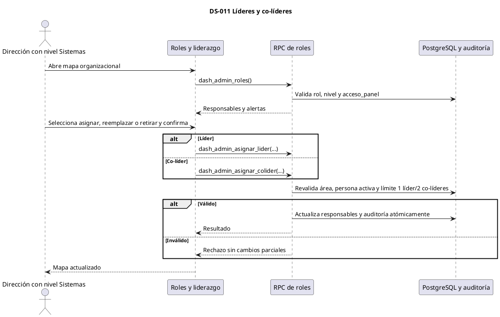
```plantuml
@startuml
title DS-011 Líderes y co-líderes
actor "Dirección con nivel Sistemas" as U
participant "Roles y liderazgo" as W
participant "RPC de roles" as R
participant "PostgreSQL y auditoría" as B
U -> W: Abre mapa organizacional
W -> R: dash_admin_roles()
R -> B: Valida rol, nivel y acceso_panel
R --> W: Responsables y alertas
U -> W: Selecciona asignar, reemplazar o retirar y confirma
alt Líder
W -> R: dash_admin_asignar_lider(...)
else Co-líder
W -> R: dash_admin_asignar_colider(...)
end
R -> B: Revalida área, persona activa y límite 1 líder/2 co-líderes
alt Válido
R -> B: Actualiza responsables y auditoría atómicamente
R --> W: Resultado
else Inválido
R --> W: Rechazo sin cambios parciales
end
W --> U: Mapa actualizado
@enduml
```

## DS-012. Inicio de sesión personal

**Trazabilidad:** RF-001–RF-015. La matriz detalla asociaciones y RNF.

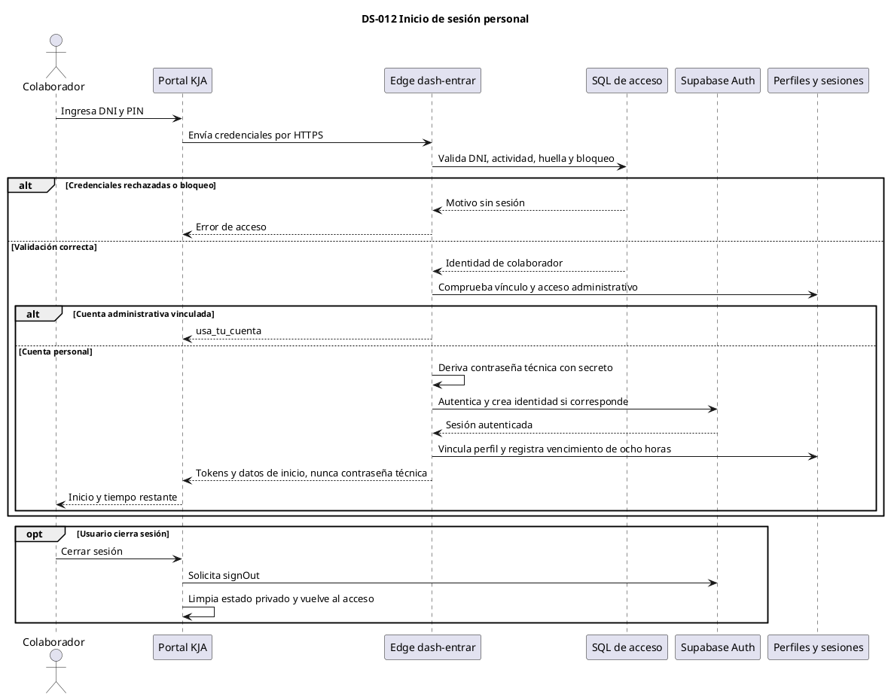
```plantuml
@startuml
title DS-012 Inicio de sesión personal
actor "Colaborador" as U
participant "Portal KJA" as W
participant "Edge dash-entrar" as E
participant "SQL de acceso" as R
participant "Supabase Auth" as A
participant "Perfiles y sesiones" as B
U -> W: Ingresa DNI y PIN
W -> E: Envía credenciales por HTTPS
E -> R: Valida DNI, actividad, huella y bloqueo
alt Credenciales rechazadas o bloqueo
R --> E: Motivo sin sesión
E --> W: Error de acceso
else Validación correcta
R --> E: Identidad de colaborador
E -> B: Comprueba vínculo y acceso administrativo
alt Cuenta administrativa vinculada
E --> W: usa_tu_cuenta
else Cuenta personal
E -> E: Deriva contraseña técnica con secreto
E -> A: Autentica y crea identidad si corresponde
A --> E: Sesión autenticada
E -> B: Vincula perfil y registra vencimiento de ocho horas
E --> W: Tokens y datos de inicio, nunca contraseña técnica
W --> U: Inicio y tiempo restante
end
end
opt Usuario cierra sesión
U -> W: Cerrar sesión
W -> A: Solicita signOut
W -> W: Limpia estado privado y vuelve al acceso
end
@enduml
```

## DS-013. Entrada segura con modalidad y evidencia

**Trazabilidad:** RF-025–RF-040, RF-126, RF-130–RF-131. La matriz detalla asociaciones y RNF.

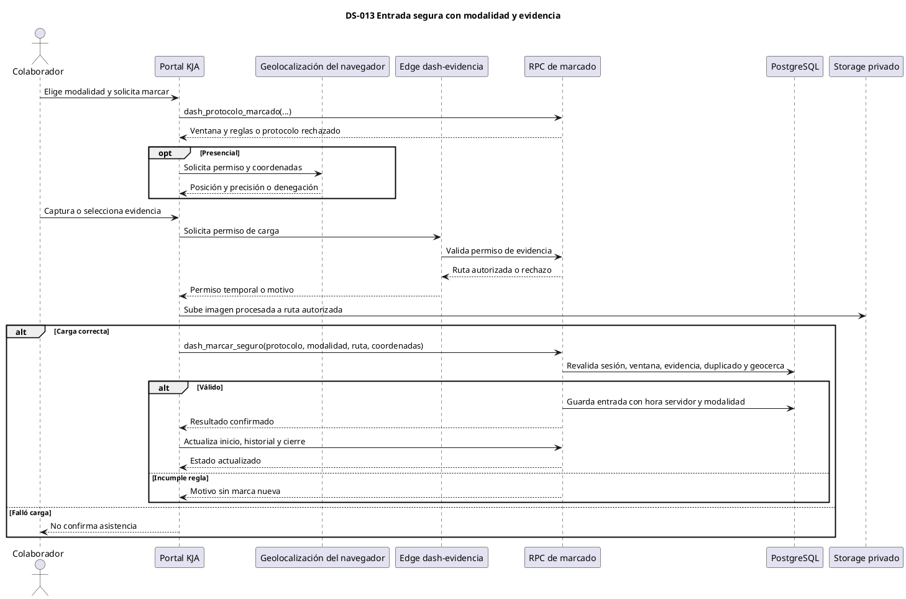
```plantuml
@startuml
title DS-013 Entrada segura con modalidad y evidencia
actor "Colaborador" as U
participant "Portal KJA" as W
participant "Geolocalización del navegador" as G
participant "Edge dash-evidencia" as E
participant "RPC de marcado" as R
participant "PostgreSQL" as B
participant "Storage privado" as S
U -> W: Elige modalidad y solicita marcar
W -> R: dash_protocolo_marcado(...)
R --> W: Ventana y reglas o protocolo rechazado
opt Presencial
W -> G: Solicita permiso y coordenadas
G --> W: Posición y precisión o denegación
end
U -> W: Captura o selecciona evidencia
W -> E: Solicita permiso de carga
E -> R: Valida permiso de evidencia
R --> E: Ruta autorizada o rechazo
E --> W: Permiso temporal o motivo
W -> S: Sube imagen procesada a ruta autorizada
alt Carga correcta
W -> R: dash_marcar_seguro(protocolo, modalidad, ruta, coordenadas)
R -> B: Revalida sesión, ventana, evidencia, duplicado y geocerca
alt Válido
R -> B: Guarda entrada con hora servidor y modalidad
R --> W: Resultado confirmado
W -> R: Actualiza inicio, historial y cierre
R --> W: Estado actualizado
else Incumple regla
R --> W: Motivo sin marca nueva
end
else Falló carga
W --> U: No confirma asistencia
end
@enduml
```

## DS-014. Inicio, historial y perfil personal

**Trazabilidad:** RF-016–RF-024, RF-041–RF-048, RF-125, RF-127. La matriz detalla asociaciones y RNF.

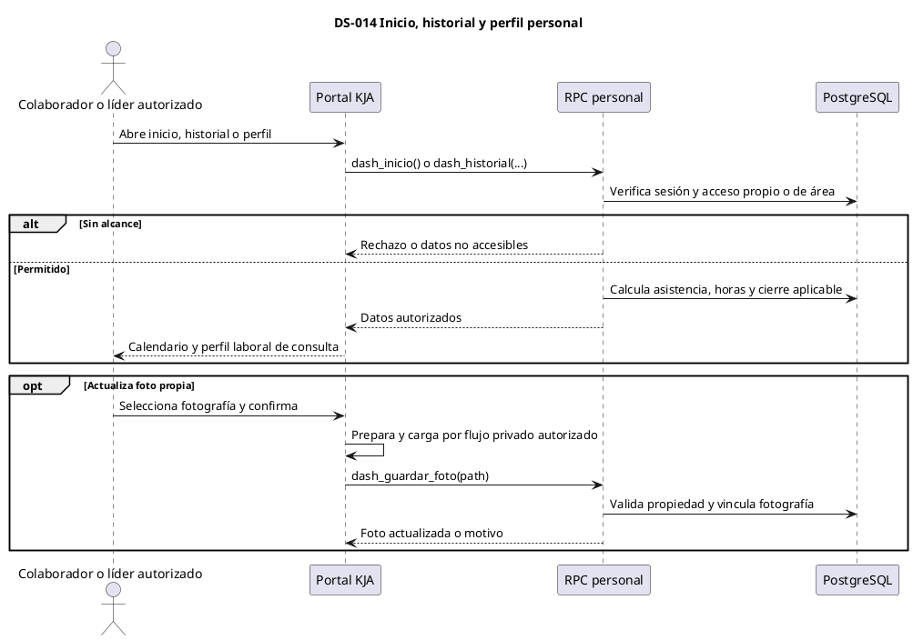
```plantuml
@startuml
title DS-014 Inicio, historial y perfil personal
actor "Colaborador o líder autorizado" as U
participant "Portal KJA" as W
participant "RPC personal" as R
participant "PostgreSQL" as B
U -> W: Abre inicio, historial o perfil
W -> R: dash_inicio() o dash_historial(...)
R -> B: Verifica sesión y acceso propio o de área
alt Sin alcance
R --> W: Rechazo o datos no accesibles
else Permitido
R -> B: Calcula asistencia, horas y cierre aplicable
R --> W: Datos autorizados
W --> U: Calendario y perfil laboral de consulta
end
opt Actualiza foto propia
U -> W: Selecciona fotografía y confirma
W -> W: Prepara y carga por flujo privado autorizado
W -> R: dash_guardar_foto(path)
R -> B: Valida propiedad y vincula fotografía
R --> W: Foto actualizada o motivo
end
@enduml
```

## DS-015. Solicitudes personales

**Trazabilidad:** RF-128–RF-129. La matriz detalla asociaciones y RNF.

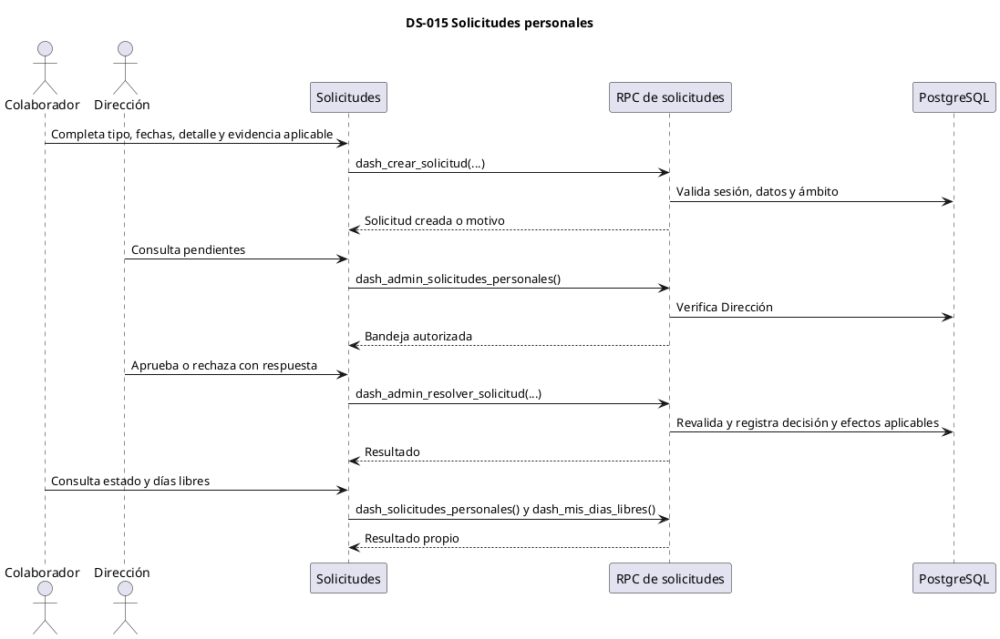
```plantuml
@startuml
title DS-015 Solicitudes personales
actor "Colaborador" as U
actor "Dirección" as A
participant "Solicitudes" as W
participant "RPC de solicitudes" as R
participant "PostgreSQL" as B
U -> W: Completa tipo, fechas, detalle y evidencia aplicable
W -> R: dash_crear_solicitud(...)
R -> B: Valida sesión, datos y ámbito
R --> W: Solicitud creada o motivo
A -> W: Consulta pendientes
W -> R: dash_admin_solicitudes_personales()
R -> B: Verifica Dirección
R --> W: Bandeja autorizada
A -> W: Aprueba o rechaza con respuesta
W -> R: dash_admin_resolver_solicitud(...)
R -> B: Revalida y registra decisión y efectos aplicables
R --> W: Resultado
U -> W: Consulta estado y días libres
W -> R: dash_solicitudes_personales() y dash_mis_dias_libres()
R --> W: Resultado propio
@enduml
```

## DS-016. Evidencia Facebook, eliminación y comprobante

**Trazabilidad:** RF-144–RF-147. La matriz detalla asociaciones y RNF.

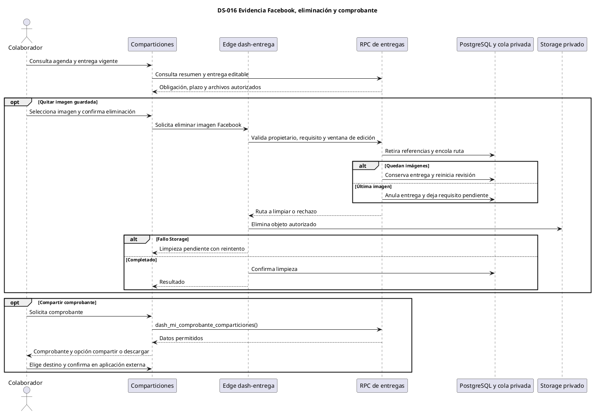
```plantuml
@startuml
title DS-016 Evidencia Facebook, eliminación y comprobante
actor "Colaborador" as U
participant "Comparticiones" as W
participant "Edge dash-entrega" as E
participant "RPC de entregas" as R
participant "PostgreSQL y cola privada" as B
participant "Storage privado" as S
U -> W: Consulta agenda y entrega vigente
W -> R: Consulta resumen y entrega editable
R --> W: Obligación, plazo y archivos autorizados
opt Quitar imagen guardada
U -> W: Selecciona imagen y confirma eliminación
W -> E: Solicita eliminar imagen Facebook
E -> R: Valida propietario, requisito y ventana de edición
R -> B: Retira referencias y encola ruta
alt Quedan imágenes
R -> B: Conserva entrega y reinicia revisión
else Última imagen
R -> B: Anula entrega y deja requisito pendiente
end
R --> E: Ruta a limpiar o rechazo
E -> S: Elimina objeto autorizado
alt Fallo Storage
E --> W: Limpieza pendiente con reintento
else Completado
E -> B: Confirma limpieza
E --> W: Resultado
end
end
opt Compartir comprobante
U -> W: Solicita comprobante
W -> R: dash_mi_comprobante_comparticiones()
R --> W: Datos permitidos
W --> U: Comprobante y opción compartir o descargar
U -> W: Elige destino y confirma en aplicación externa
end
@enduml
```

## DS-017. Resolución de excepciones de jornada

**Trazabilidad:** RF-140–RF-144, RF-158. La matriz detalla asociaciones y RNF.

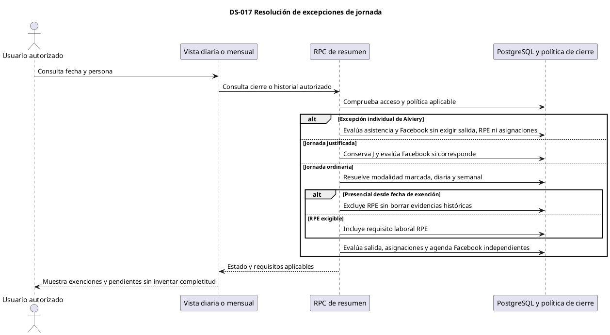
```plantuml
@startuml
title DS-017 Resolución de excepciones de jornada
actor "Usuario autorizado" as U
participant "Vista diaria o mensual" as W
participant "RPC de resumen" as R
participant "PostgreSQL y política de cierre" as B
U -> W: Consulta fecha y persona
W -> R: Consulta cierre o historial autorizado
R -> B: Comprueba acceso y política aplicable
alt Excepción individual de Alviery
R -> B: Evalúa asistencia y Facebook sin exigir salida, RPE ni asignaciones
else Jornada justificada
R -> B: Conserva J y evalúa Facebook si corresponde
else Jornada ordinaria
R -> B: Resuelve modalidad marcada, diaria y semanal
alt Presencial desde fecha de exención
R -> B: Excluye RPE sin borrar evidencias históricas
else RPE exigible
R -> B: Incluye requisito laboral RPE
end
R -> B: Evalúa salida, asignaciones y agenda Facebook independientes
end
R --> W: Estado y requisitos aplicables
W --> U: Muestra exenciones y pendientes sin inventar completitud
@enduml
```

## DS-018. Ranking mensual provisional

**Trazabilidad:** RF-157–RF-159. La matriz detalla asociaciones y RNF.

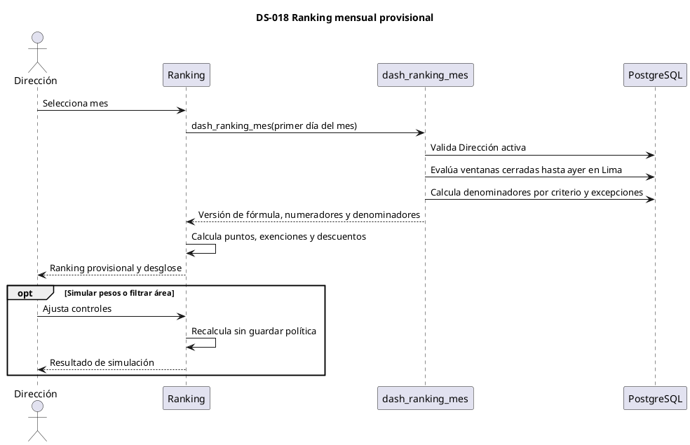
```plantuml
@startuml
title DS-018 Ranking mensual provisional
actor "Dirección" as U
participant "Ranking" as W
participant "dash_ranking_mes" as R
participant "PostgreSQL" as B
U -> W: Selecciona mes
W -> R: dash_ranking_mes(primer día del mes)
R -> B: Valida Dirección activa
R -> B: Evalúa ventanas cerradas hasta ayer en Lima
R -> B: Calcula denominadores por criterio y excepciones
R --> W: Versión de fórmula, numeradores y denominadores
W -> W: Calcula puntos, exenciones y descuentos
W --> U: Ranking provisional y desglose
opt Simular pesos o filtrar área
U -> W: Ajusta controles
W -> W: Recalcula sin guardar política
W --> U: Resultado de simulación
end
@enduml
```

## DS-019. Reporte Facebook y exportaciones

**Trazabilidad:** RF-160–RF-163. La matriz detalla asociaciones y RNF.

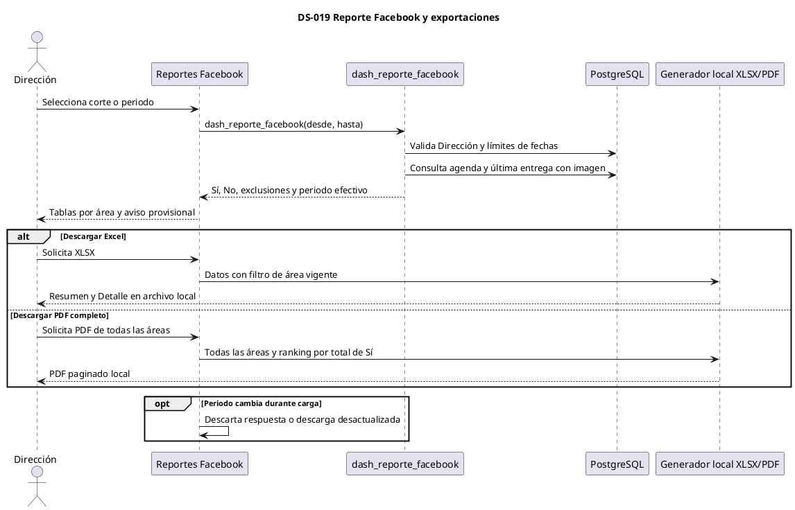
```plantuml
@startuml
title DS-019 Reporte Facebook y exportaciones
actor "Dirección" as U
participant "Reportes Facebook" as W
participant "dash_reporte_facebook" as R
participant "PostgreSQL" as B
participant "Generador local XLSX/PDF" as X
U -> W: Selecciona corte o periodo
W -> R: dash_reporte_facebook(desde, hasta)
R -> B: Valida Dirección y límites de fechas
R -> B: Consulta agenda y última entrega con imagen
R --> W: Sí, No, exclusiones y periodo efectivo
W --> U: Tablas por área y aviso provisional
alt Descargar Excel
U -> W: Solicita XLSX
W -> X: Datos con filtro de área vigente
X --> U: Resumen y Detalle en archivo local
else Descargar PDF completo
U -> W: Solicita PDF de todas las áreas
W -> X: Todas las áreas y ranking por total de Sí
X --> U: PDF paginado local
end
opt Periodo cambia durante carga
W -> W: Descarta respuesta o descarga desactualizada
end
@enduml
```

## DS-020. Chat privado con texto o imagen

**Trazabilidad:** RF-165–RF-169. La matriz detalla asociaciones y RNF.

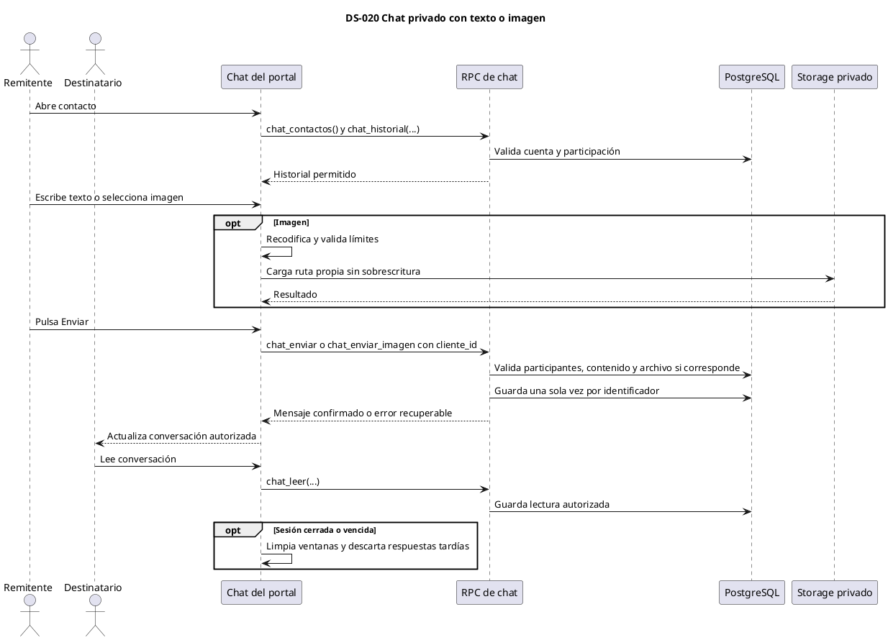
```plantuml
@startuml
title DS-020 Chat privado con texto o imagen
actor "Remitente" as U
actor "Destinatario" as V
participant "Chat del portal" as W
participant "RPC de chat" as R
participant "PostgreSQL" as B
participant "Storage privado" as S
U -> W: Abre contacto
W -> R: chat_contactos() y chat_historial(...)
R -> B: Valida cuenta y participación
R --> W: Historial permitido
U -> W: Escribe texto o selecciona imagen
opt Imagen
W -> W: Recodifica y valida límites
W -> S: Carga ruta propia sin sobrescritura
S --> W: Resultado
end
U -> W: Pulsa Enviar
W -> R: chat_enviar o chat_enviar_imagen con cliente_id
R -> B: Valida participantes, contenido y archivo si corresponde
R -> B: Guarda una sola vez por identificador
R --> W: Mensaje confirmado o error recuperable
W --> V: Actualiza conversación autorizada
V -> W: Lee conversación
W -> R: chat_leer(...)
R -> B: Guarda lectura autorizada
opt Sesión cerrada o vencida
W -> W: Limpia ventanas y descarta respuestas tardías
end
@enduml
```

## DS-021. Borrador, revisión y publicación de Marketing

**Trazabilidad:** RF-170–RF-175. La matriz detalla asociaciones y RNF.

```plantuml
@startuml
title DS-021 Borrador, revisión y publicación de Marketing
actor "Marketing autorizado" as U
participant "Publicaciones" as W
participant "Edge marketing-publicaciones" as E
participant "PostgreSQL y Storage privado" as B
participant "Gemini" as G
participant "Facebook" as F
U -> W: Adjunta flyer o prepara texto manual
alt Lectura explícita de flyer
U -> W: Pulsa Leer información
W -> E: Solicita análisis de borrador
E -> B: Verifica permiso, propiedad, caché y reserva atómica
alt Extracción disponible
B --> E: Datos persistidos
else Cuota disponible y reserva válida
E -> G: Solicita extracción
G --> E: Resultado o error
E -> B: Persiste resultado válido
else Sin cuota o reserva ocupada
E --> W: Motivo sin lectura nueva
end
E --> W: Datos o error sin reintento automático
else Texto manual
W -> W: Organiza datos sin llamada a Gemini
end
U -> W: Revisa copy y enlace; confirma publicación
W -> E: Guarda borrador y solicita publicar revisado
E -> B: Revalida permiso y reclama borrador atómicamente
alt Reclamo autorizado
E -> F: Envía imagen y copy
alt Éxito confirmado
F --> E: Identificador de publicación
E -> B: Guarda publicado e identificador
else Timeout o resultado ambiguo
E -> B: Conserva estado incierto para comprobación
end
else Sin permiso o reclamo duplicado
E --> W: Rechazo sin nuevo envío
end
E --> W: Resultado
W --> U: Publicado, error o pendiente de comprobar
@enduml
```

## DS-022. Impedimentos y control diario

**Trazabilidad:** RF-154–RF-156. La matriz detalla asociaciones y RNF.

```plantuml
@startuml
title DS-022 Impedimentos y control diario
actor "Colaborador" as U
actor "Dirección o líder autorizado" as A
participant "Portal y supervisión" as W
participant "RPC de impedimentos" as R
participant "PostgreSQL" as B
U -> W: Reporta motivo para un requisito pendiente
W -> R: dash_reportar_impedimento(...)
R -> B: Valida sesión, requisito, ventana y detalle
R -> B: Guarda aviso sin completar evidencia
R --> W: Impedimento informado
A -> W: Consulta control diario o equipo
W -> R: dash_supervision_impedimentos(fecha)
R -> B: Filtra ámbito de Dirección o área
R --> W: Avisos autorizados
opt Colaborador entrega evidencia
U -> W: Completa entrega por flujo de carga
W -> R: Confirma entrega válida
R -> B: Resuelve impedimento vinculado
R --> W: Estado actualizado
end
@enduml
```
