# Diagramas de secuencia — Administración (PlantUML)

Cada bloque es independiente: copia desde `@startuml` hasta `@enduml` en
PlantUML para renderizarlo.

## 1. Entrada al dominio Administración y carga del resumen

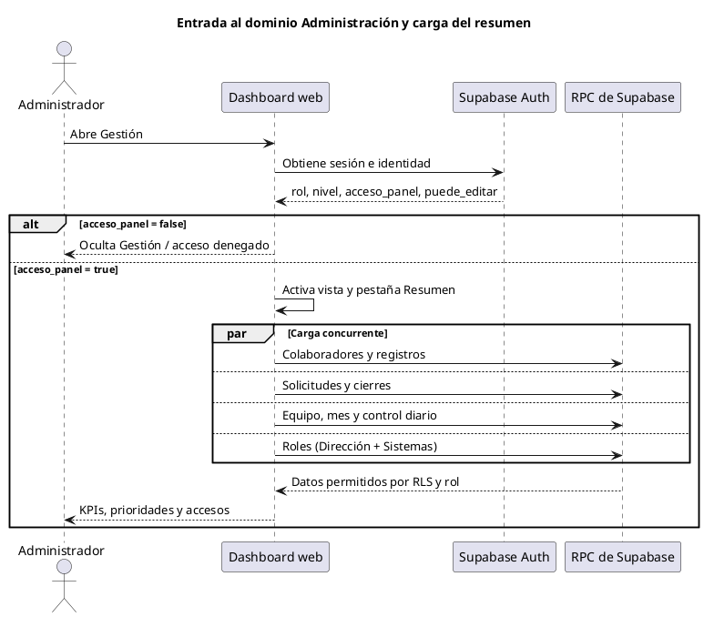

## 2. Pasar lista: marcar, corregir o retirar una asistencia

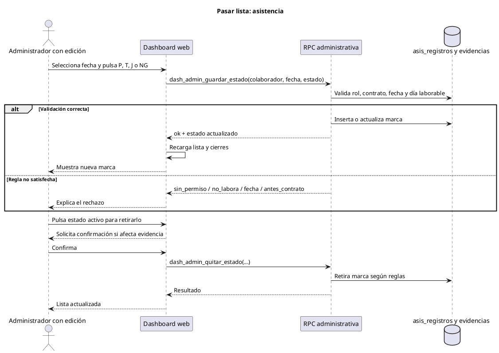

## 3. Gestión mensual: excepción, feriado o corrección

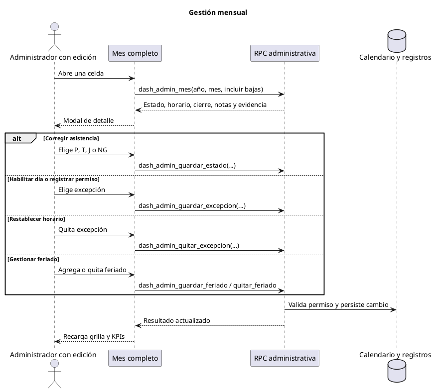

## 4. Cierre normal de jornada por el colaborador

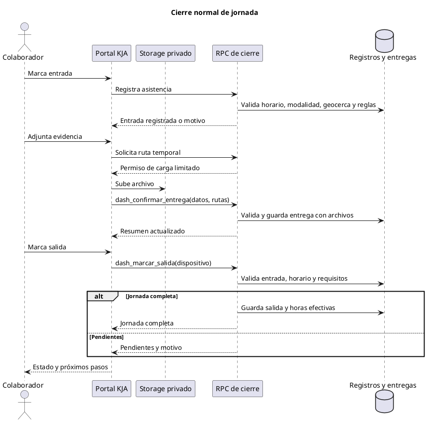

## 5. Revisión de evidencias desde Cierres y entregables

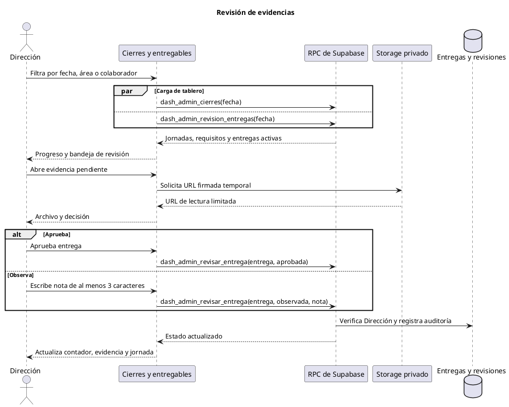

## 6. Dirección carga una evidencia recibida por otro canal

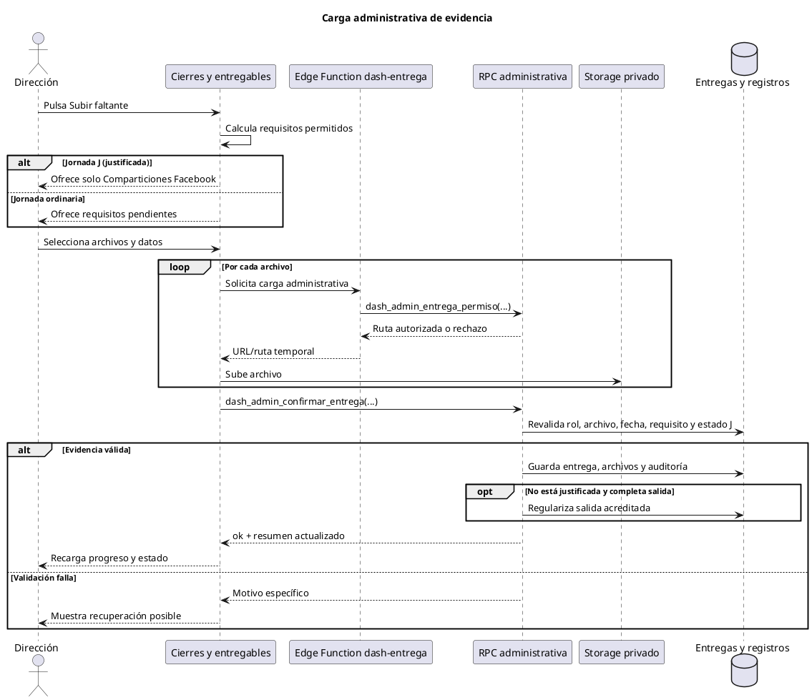

## 7. Crear una asignación o realizar un sorteo

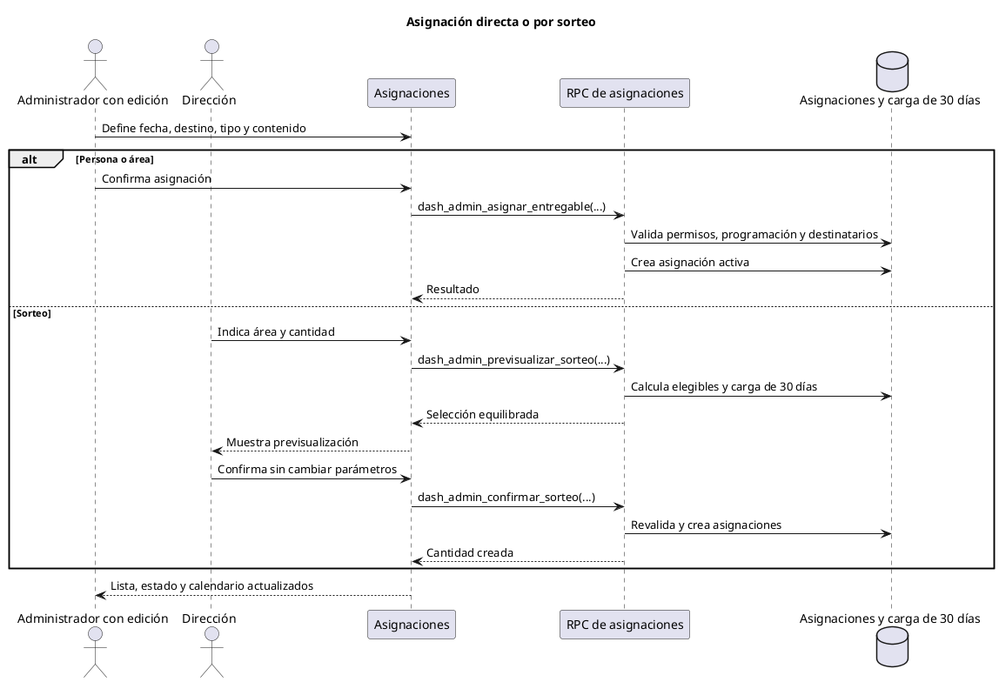

## 8. Retiro de una asignación y limpieza de archivos

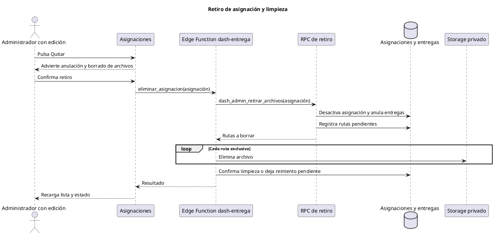

## 9. Alta o actualización de colaborador

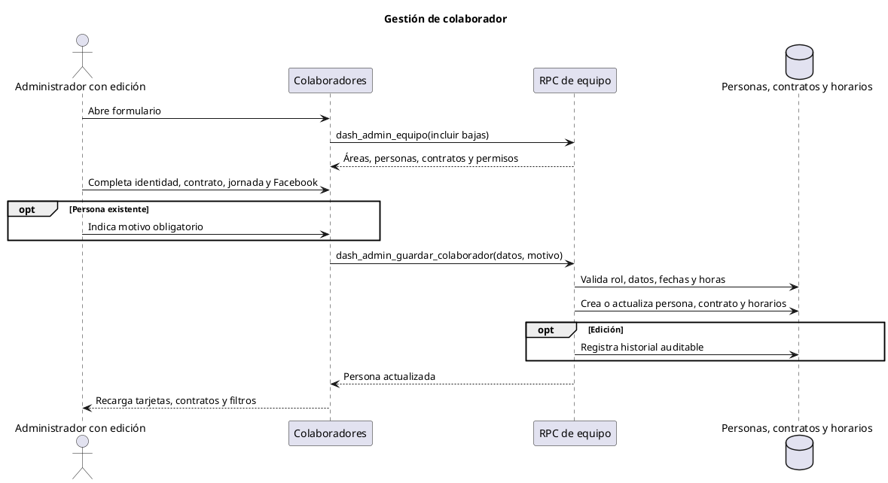

## 10. Marcado propio: reglas, PIN y solicitud de horario

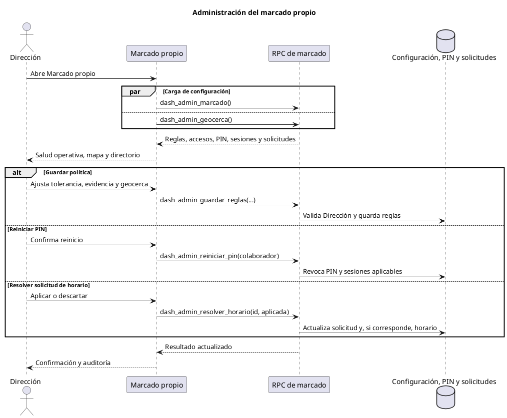

## 11. Asignar, reemplazar o retirar liderazgo

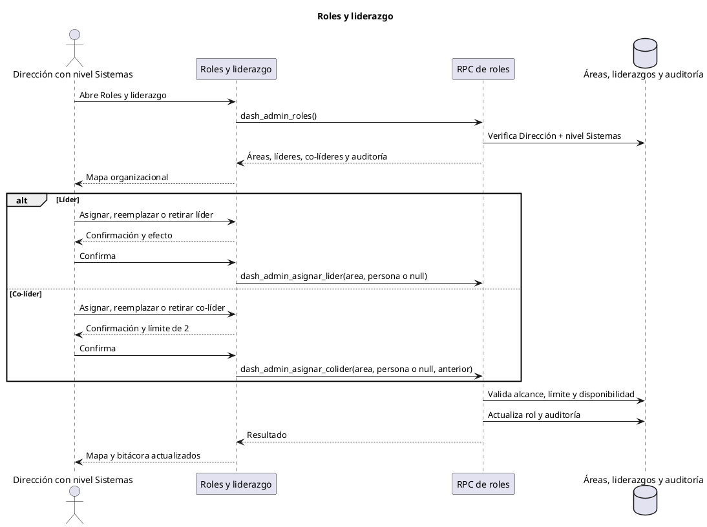
